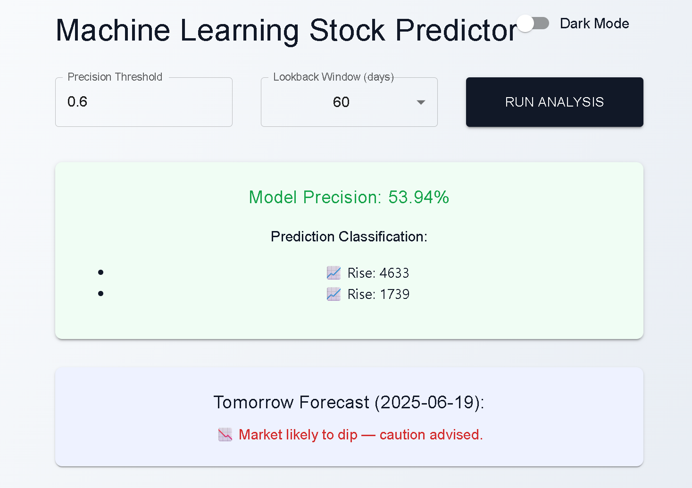
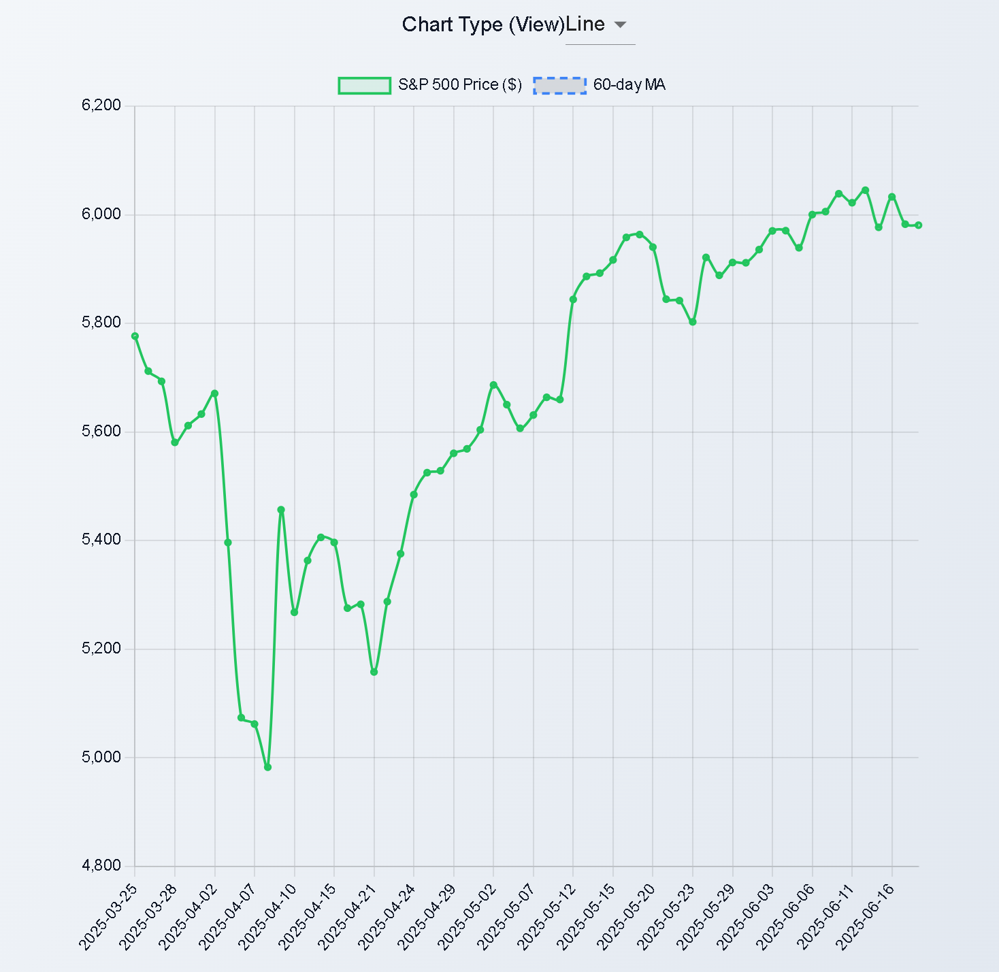

# 🧠 Machine Learning Stock Predictor

An interactive dashboard for predicting S&P 500 trends using Random Forest models and historical indicators. Built with **React**, **Chart.js**, and **Flask**, this app allows users to dynamically explore forecasts and run customizable backtests.




---

## 🔍 Features

- 📈 Line & Bar chart toggling (Chart.js)
- 🧪 Adjustable threshold & moving average window
- 🌓 Light & dark mode toggle
- 🧠 Tomorrow’s prediction and next recommended buy date
- 🔄 Live S&P 500 historical data with moving average overlays

---

## 🚀 Technologies

- **Frontend**: React, Chart.js, Material UI
- **Backend**: Python (Flask), scikit-learn, yfinance
- **ML Model**: Random Forest classifier
- **Data Source**: Yahoo Finance (via `yfinance`)

---

## 📦 Setup

```bash
# frontend
cd frontend
npm install
npm run dev

# backend
cd backend
pip install -r requirements.txt
python app.py
